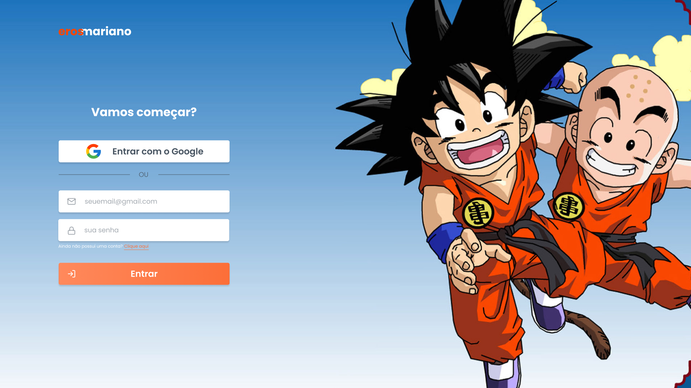

<h1 align="center">
    
</h1>

<h4 align="center"> 
	🐉 Dragon Ball Z Project🐉
</h4>

## 💻 Sobre o projeto

♻️ Dragon Ball Z Project - Faz parte de um projeto de desafios semanais proposto por 
[iuricode](https://github.com/iuricode "https://github.com/iuricode") e este foi o primeiro!   O primeiro e os demais desafios estão nesse repositório do figma: [Codelândia - Desafios – Figma](https://www.figma.com/file/Yb9IBH56g7T1hdIyZ3BMNO/Codel%C3%A2ndia---Desafios?node-id=0%3A1)

## 🎨 Meu Layout

O layout da aplicação está disponível no Figma:

### 🎨 StyleGuide
  

### Mobile

  

  

  

  
  

### Web

  

  

## 🛠 Tecnologias

🚧 Em construção... 🚧

## 🚀 Como executar o projeto
🚧 Em construção... 🚧

### Pré-requisitos
🚧 Em construção... 🚧

### 🎲 Rodando o Back End (servidor)
🚧 Em construção... 🚧

### 🧭 Rodando a aplicação web (Front End)

### 📱Rodando a aplicação mobile 

🚧 Em construção... 🚧
